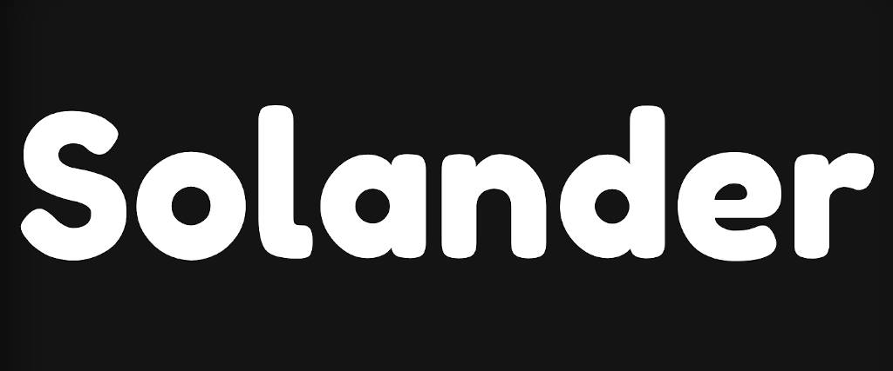

  
   
   
  
  
  
  
  

***Acesta este repo-ul oficial al aplicatiei Solander.***

Daca vrei sa ajuti proiectul Solander, intra pe server-ul meu de [Discord](https://discord.gg/MvsMkMN)

## Detalii
* Solander este construit cu [React](https://reactjs.org/) (folosit in : Facebook, Instagram, Netflix, Discord, etc).

* Ca baza de date, si host, foloseste [Firebase](https://firebase.google.com/) (folosit in: Twitch, eToro, etc).

* Solander foloseste o librarie de CSS numita [Ergaleio](https://github.com/clandestinz/ergaleio-library) (proiect personal, folosit in: site-ul Laika Bot).
## Utilizare

O data ce ai clonat acest repo, trebuie sa rulezi `npm install`. Asta este necesar pentru a instala toate modulele.

Dupa poti rula `npm start` pentru a porni server-ul in dev mode.

Pentru a creea un build static, ruleaza `npm run build`.

## FAQ

> Q: Cum pot ajuta la proiect?  
A: Trebuie sa stii sa te joci cu JSX, CSS, Git, React. Nu este nici o problema daca nu stii astea, dar este necesar macar sa stii cum functioneaza programarea.

>Q: Vreau sa ajut, dar nu stiu sa programez.  
A: Nu este nici o problema. Poti sa te alaturi server-ului de Discord si sa sugerezi schimbari sau sa gasesti probleme.

> Q: Pot sa fur Solander?  
A: Desigur, totusi doar ca proiect personal, non-comercial.

> Q: Ce my little pony este Github?  
A: Este pestera tocilarilor. Daca nu stii ce este Github, atunci nu esti tocilar.

> Q: Pot sa donez?  
A: Desigur ca nu. Momentan, Solander ramane un proiect liber, complet gratis. Si va ramane asa ceva vreme.

> Q: Am vazut un token/API key. Nu este periculos?  
A: Nu este deloc periculos. Acestea sunt necesare pentru a comunica cu serverele Firebase si nu pot fi folosite pentru a cauza dauna. Asa ca lasa fusta mai jos.
